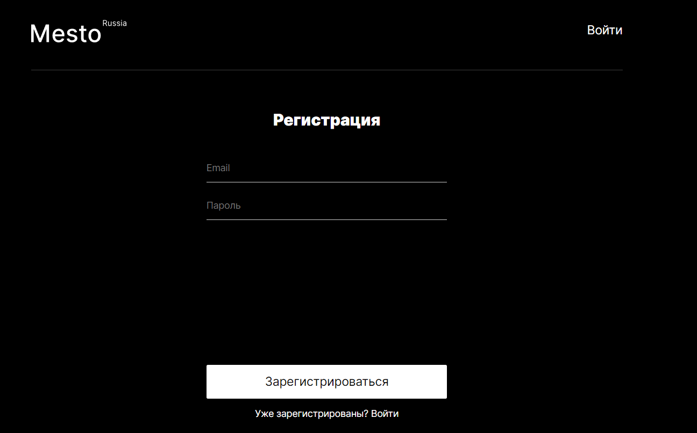
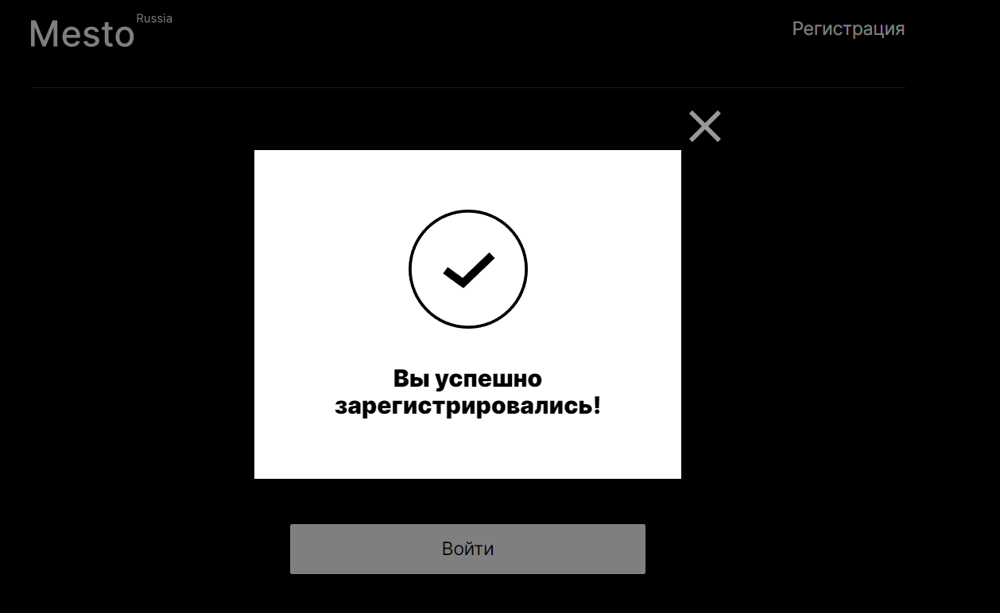
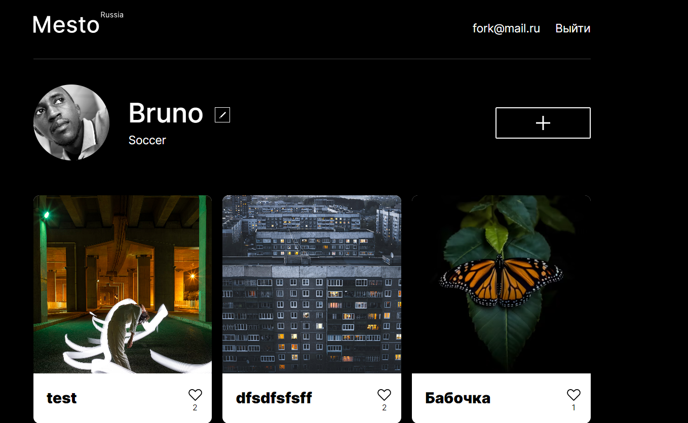
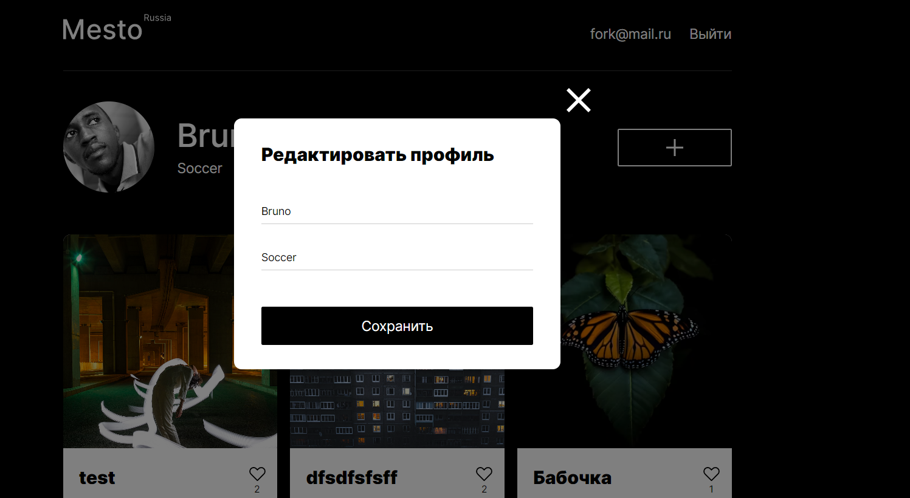
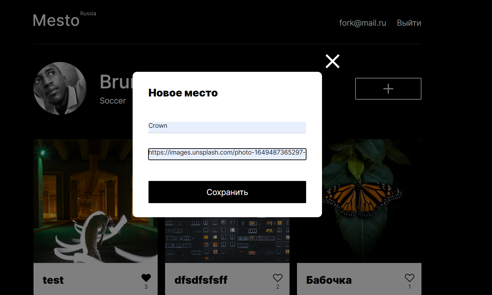

# Проект Mesto - настройка backend и frontend компонентов в единое приложение   
### Обзор проекта
* Описание
* В проекте реализовано
* Используемые технологии
* Скриншоты
* Итоги реализации проекта

## Описание 
Проект Место (backend + frontend) - это практическая работа реализованая в ходе обучения в Яндекс.Практикуме.
Данный учебный проект направлен на закрепление теории на практике в части разработки серверной части приложения, подключения frontend-части приложения (написанной на React) к backend-части, деплой проекта на удаленном сервере. 
Деплой проекта происходит на удаленном сервере, с доменными именами и подключенными сертификатами

*В проекте реализовано*
* Frontend
1. регистрация и авторизация
2. редактирование профиля
3. добавление/удаление карточки
4. постановка и снятие лайка
5. масштабирование картинки при клике

* Backend
1. Запуск сервера на Node.js и Express
2. Реализация контроллеров, модулей и роутов
3. Подключение к базе данных
4. Реализация запросов к базе данных
5. Обработка ошибок
6. настройка работы с удаленным сервером
7. реализация основ по политике cors для работы в браузере
8. настроено логирование запросов и ошибок
9. настройка авторизации через cookie
10. настройка .env

## Используемые технологии:
1. HTML
2. CSS
3. Javascript
4. Webpack
5. React
6. Node.js
7. Express
8. MongoDB
9. Postman

## Скриншоты

## Итоги реализации проекта:
В данном проекте проведена работа по основам backend - создание сервера, подключение сервера к базе данных, настройка API, деплой проекта на удаленный сервер, подключение frontend к backend.
Данный проект помог в закреплении и применении на практике полученных знаний, по Node.js, MongoDB, Postman, JS, React, DevTools
